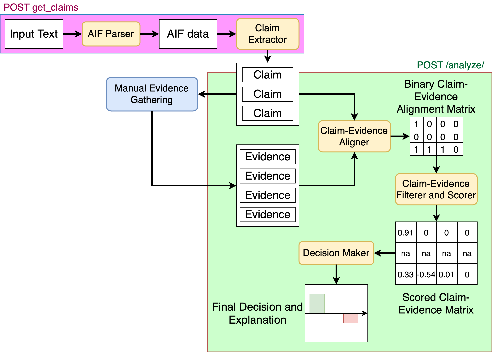

# CEASystem: Claim-Evidence Analyzer System

## About The Project
This project aims to automate and help in decision-making process based on the analysis of competitive hypothesis methodology (ACH).
The project contains modules, ready-to-use fastAPI-based service and simple niceGUI-based UI containers.

## Project Components and Architecture


On the picture, the overall flow of modules is presented. The input text is converted to the [AIF](http://www.arg-tech.org/wp-content/uploads/2011/09/aif-spec.pdf) format (see [example_aif.json](example_aif.json)) for the example.
On the next step, the claims are retrieved from the AIF graph by the rule-based approach. The provided claims are then evaluated manually and a set of evidences for the claims is provided to the system.
Claims and evidences are processed by the alignment model to determine which evidence is relevant to which claims. The obtained binary alignment matrix passed through the filtering and scoring models. Models decide how influential evidences are to the claims. Some of them will be filtered (e.g. if evidence supports all or none of the claims).
Finally, based on the scoring matrix the decision is drawn as a set of scores, how likely or unlikely for the claim to be rejected or accepted. The closer the score to +1, the more likely for the claim to be accepted. The closer it to -1, the more likely for the claim to be rejected. 
As an explanation otput, the final scoring matrix is provided, with the indications on which evidences were filtered.
<br> More details will be provided further.

# Getting Started

## Running API
To run the API, you will need to download and unzip in the repo directory required trained models for the tasks:
1. Claim-Evidence Alignment model. Binary classificator that predict if the evidence is relevant to the claim. Can be downloaded here (contact me for the model).

To run the model, you can simply run it via python: 
```commandline
# default to localhost:8000
python app.py 
```

or with uvicorn:
```commandline
uvicorn app:app --host "0.0.0.0" --port 8000
```

## Running as Docker service
All required components and commands are in [Dockerfile](Dockerfile). Build an image and run as a container:
```commandline
cd CEASystem/
docker build . -t ceas_service
docker run -d -p 8000:8000 ceas_service
```

## Methods and Formats
The app has two POST requests:
 * get_claims
 * analyze

<br> Additionally, you can access docs by: <hostname>:port/docs (see fastAPI for more details). 

### get_claims
This request takes as an input text and parses it into the claims. Under the hood, the method converts text into the AIF format with pre-built ARG-tech methods and then utilizes the AIF graph structure to retrieve claims.
<br>Example input:
```python
{
    "text": "Some experts believe that Climate change is happening. There are plenty of reasons for it, but the most popular opinion is that governments are really slow, when it comes to reaction to the climate change. Other people claim that renewable energy is a scam that should be stopped.",
}
```
Input fields:
* text: str, required. Unprocessed article to parse.
* <i>keep_ya_nodes_texts</i>: list of str, optional. Default: []. The expected input is a list of texts for YA nodes from AIF 
edges format (e.g. "Default Inference", "Default Conflict", etc) to consider to be a parent of the possible type I node claim. Others will not be considered as claims. If [], will be ignored.

Example outputs:
```python
# success
{
  "code": 200,
  "output": {
    "hypothesis": [
      "Some experts believe that Climate change is happening",
      "There are plenty of reasons for it, but the most popular opinion is that governments are really slow, when it comes to reaction to the climate change",
      "Other people claim that renewable energy is a scam that should be stopped"
    ],
    "hypothesis_nodes": [
      {
        "nodeID": "1",
        "text": "Climate change is happening",
        "type": "I",
        "timestamp": "2020-05-28 19:24:34"
      },
      {
        "nodeID": "2",
        "text": "governments are really slow, when it comes to reaction to the climate change",
        "type": "I",
        "timestamp": "2020-05-28 19:24:31"
    },
    {
        "nodeID": "3",
        "text": "renewable energy is a scam",
        "type": "I",
        "timestamp": "2020-05-28 19:24:35"
    }
],
    "structure_hypothesis_graph": [
    {
        "fromID": "2",
        "toID": "1",
        "relation": "Asserting"
    },
    {
        "fromID": "1",
        "toID": "3",
        "relation": "Contradiction"
    }
]
  }
}

# error
{
    "code": 400,
    "output": {"Error": "Empty text"},
}

```
<br> Output keys:

* code: int, 200 or 400. 200 means successful run, 400 error.
* output: dict:
  * hypothesis: list of strings, retrieved claims from text. Substrings of the text. 
  * hypothesis_nodes: list of dicts; meta info of nodes retrieved from the graph. It is required for the article generation (separate service).
  * structure_hypothesis_graph: list of dicts; relationships between the nodes (cut of the graph). It is required for the article generation (separate service).

### analyze
This request takes as an input claims and evidences. The algorithm analyzes claim-evidence alignment and produces claim-evidence score matrix, and scores per claim on the decision.
<br>Example input:
```python
{
  "hypothesis": [
    "Climate change is happening",
    "governments are really slow, when it comes to reaction to the climate change",
    "renewable energy is a scam"
  ],
  "manual_evidences": [
    "renewable energy sector generats plenty of jobs according to me",
    "the coal industry provides a lot of jobs as well",
    "there are a lot of money in wind, hydro electricity, solar panels to be made, with the benefits to humanity",
    "The level is rising for the last 3 decades, studies show",
    "The ocean level did not rise significantly",
    "Some countries deploy very strict regulations to the gas companies",
    "The limits are set for the amount of waste every country could emit",
    "Some countries are very slow to higher their ecology standards",
    "The amount of lifestock is getting bigger every year",
    "The President of the United States uses his plane very oftenly during his term",
    "The wind stations are on a rise",
    "The hydro stations do not provide enough electricity even for a small town of 1000 people",
    "The earth is not flat, but it is shaped as a banana",
    "Ipod was made from execcive amount of plastic"
  ],
  
  "max_alignment_limit": -1,
  "min_alignment_limit": -1,
  
  "hypothesis_nodes": [
      {
        "nodeID": "1",
        "text": "Climate change is happening",
        "type": "I",
        "timestamp": "2020-05-28 19:24:34"
      },
      {
        "nodeID": "2",
        "text": "governments are really slow, when it comes to reaction to the climate change",
        "type": "I",
        "timestamp": "2020-05-28 19:24:31"
    },
    {
        "nodeID": "3",
        "text": "renewable energy is a scam",
        "type": "I",
        "timestamp": "2020-05-28 19:24:35"
    }
],
    "structure_hypothesis_graph": [
    {
        "fromID": "2",
        "toID": "1",
        "relation": "Asserting"
    },
    {
        "fromID": "1",
        "toID": "3",
        "relation": "Contradiction"
    }
]
}
```

Input keys:
* hypothesis, evidences: list of str, hypothesis and evidences to score and align.
* hypothesis_nodes: list of dicts; meta info of nodes retrieved from the graph. It will be used to reorder info based on decision scores per hypothesis. It is required for the article generation (separate service).
* structure_hypothesis_graph: list of dicts; relationships between the nodes (cut of the graph). It is required for the article generation (separate service).
* min_alignment_limit: Optional - int, default = -1, minimum aligned limit. If >= 0, the evidences that support <= min_alignment_limit claims will be removed. If -1, will be ignored
* max_alignment_limit: Optional - int, default = -1, maximum aligned limit. If >= 0, the evidences that support >= max_alignment_limit claims will be removed. If -1, will be ignored 


<br> Example outputs:

```python
{
  "code": 200,
  "output": {
    "ordered_hypothesises": [
      "governments are really slow, when it comes to reaction to the climate change",
      "renewable energy is a scam",
      "Climate change is happening"
    ],
    "ordered_hypothesises_scores": [-1,-0.743,0.101],
    "filtered_scoring_matrix": [
      [0,0,0,0,0,-0.139,0,0.341,0,0,0,0,0,0],
      [-0.834,0,-0.652,0,0,0,0,0,0,0,0,0,0,0],
      [0,0,0,0,0,0,0,0,0,0,0,0,0,0]
    ],
    "kept_evidences": [
      "renewable energy sector generats plenty of jobs according to me",
      "the coal industry provides a lot of jobs as well",
      "there are a lot of money in wind, hydro electricity, solar panels to be made, with the benefits to humanity",
      "The level is rising for the last 3 decades, studies show",
      "The ocean level did not rise significantly",
      "Some countries deploy very strict regulations to the gas companies",
      "The limits are set for the amount of waste every country could emit",
      "Some countries are very slow to higher their ecology standards",
      "The amount of lifestock is getting bigger every year",
      "The President of the United States uses his plane very oftenly during his term",
      "The wind stations are on a rise",
      "The hydro stations do not provide enough electricity even for a small town of 1000 people",
      "The earth is not flat, but it is shaped as a banana",
      "Ipod was made from execcive amount of plastic"
    ],
    "dropped_evidences": [],
    "full_scoring_matrix": [
      [0,0,0,0,0,-0.139,0,0.341,0,0,0,0,0,0],
      [-0.834,0,-0.652,0,0,0,0,0,0,0,0,0,0,0],
      [0,0,0,0,0,0,0,0,0,0,0,0,0,0]
    ],
    "full_ordered_evidences": [
      "renewable energy sector generats plenty of jobs according to me",
      "the coal industry provides a lot of jobs as well",
      "there are a lot of money in wind, hydro electricity, solar panels to be made, with the benefits to humanity",
      "The level is rising for the last 3 decades, studies show",
      "The ocean level did not rise significantly",
      "Some countries deploy very strict regulations to the gas companies",
      "The limits are set for the amount of waste every country could emit",
      "Some countries are very slow to higher their ecology standards",
      "The amount of lifestock is getting bigger every year",
      "The President of the United States uses his plane very oftenly during his term",
      "The wind stations are on a rise",
      "The hydro stations do not provide enough electricity even for a small town of 1000 people",
      "The earth is not flat, but it is shaped as a banana",
      "Ipod was made from execcive amount of plastic"
    ],
    "hypothesis_nodes": [
      {
        "nodeID": "1",
        "text": "Climate change is happening",
        "type": "I",
        "timestamp": "2020-05-28 19:24:34"
      },
      {
        "nodeID": "2",
        "text": "governments are really slow, when it comes to reaction to the climate change",
        "type": "I",
        "timestamp": "2020-05-28 19:24:31"
    },
    {
        "nodeID": "3",
        "text": "renewable energy is a scam",
        "type": "I",
        "timestamp": "2020-05-28 19:24:35"
    }
],
    "structure_hypothesis_graph": [
    {
        "fromID": "2",
        "toID": "1",
        "relation": "Asserting"
    },
    {
        "fromID": "1",
        "toID": "3",
        "relation": "Contradiction"
    }
]
  }
}

# error
{
    "code": 400,
    "output": {"Error": "Value Error"},
}
```

<br> Output keys:

* code: int, 200 or 400. 200 means successful run, 400 error.
* output: dict:
  * ordered_hypothesises: list of strings, ordered claims with respect to the scores in <i>ordered_hypothesises_scores,filtered_scoring_matrix,full_scoring_matrix</i>.
  * ordered_hypothesises_scores:  list of floats;  scores for each corresponding fact in <i>ordered_hypothesises</i>. -1 meaning the highest likelihood of the fact being untrue, +1: being true.
  * dropped_evidences: list of strings; The evidence that filtered as irrelevant or unhelpful to the provided facts.
  * kept_evidences: list of string; The evidence that were considered relevant and useful to the provided facts.
  * full_scoring_matrix: list of list of floats; Matrix, where rows are corresponding to the <i>ordered_hypothesises</i> and cols are corresponding to the <i>full_ordered_evidences</i>. An (i,j) cell contains a score for the i-th element from <i>ordered_hypothesises</i> and j-th element from <i>full_ordered_evidences</i>. -1000 means that this evidence was removed from the consideration completely (because of irrelevance) for all facts. 0 means that for this particular fact this specific evidence was not considered as relevant. Values from -1 to +1 indicates the score, on how the evidence supported the fact. -1 being highly against, +1 meaning in favor. 
  * full_ordered_evidences: list of string, ordered evidences for the columns of <i>full_scoring_matrix</i>.
  * filtered_scoring_matrix: list of lists of floats; the same matrix, as <i>full_scoring_matrix</i>, but without the <i>dropped_evidences</i>.
  * ordered_hypothesises_nodeids: list of dicts; meta info of nodes retrieved from the graph. Reordered info based on decision scores per hypothesis. It is required for the article generation (separate service).
  * structure_hypothesis_graph: list of dicts; relationships between the nodes (cut of the graph). It is required for the article generation (separate service).


## Customizing behavior 
All required variables are provided in the [config.py](config.py). Specifically:
* ALIGNER_MODEL_PATH: str, path to the directory, where pre-trained aligner classifier model. Should be in huggingface saved model format. For more details, see [evidence_alignment.py](evidence_alignment.py).
* ALIGNER_BATCH_SIZE: int, batch size to use for aligner model.
* MNLI_SCORING_MODEL: str, MNLI pretrained model to use for scoring evidences/claims. Could be a link to huggingface hub (e.g. "roberta-large-mnli") or a path to a custom pre-trained model in huggingface format.
* MNLI_MODEL_LABEL_DECODER: python dict, label decoder for the model. Indicates, which labels to use and what they mean in the context of the task. For example:
```python
{"entailment": 2, "contradiction": 0}
```
In this case, the model has 3 labels: entailment, contradiction, and neutral. We are interested in entailment and contradiction only. Make sure, that the dict has these keys with the corresponding positions in the final logits of the label.
*SCORER_BATCH_SIZE: int, batch size to use for mnli model scoring.
*TURNINATOR_API: str, api route to the turninator service. 
*PROPOSITIONALIZER_API: str, api route to the propositionalizer service. 
*SEGMENTER_API: str, api route to the segmenter service. 
*RELATIONER_API: str, api route to the relationer service. 

## Running separate modules
See [examples/](examples) on how to use modules separately.
If you need only one specific module, you can find them and their description in the corresponding files:
* [claim_extraction.py](claim_extraction.py): Classes for claim extraction from the AIF formatted argumets.
* [parsing_components.py](parsing_components.py): API calls to the APIs that parse text into AIF format.
* [evidence_alignment.py](evidence_alignment.py): Classes to predict claim-evidence alignment.
* [evidence_scoring.py](evidence_scoring.py): Classes to predict claim-evidence scores and filter irrelevant with ACH methods.
* [decision_making.py](decision_making.py): Classes to predict the overall score for the claim to be accepted/rejected with the provided claims.