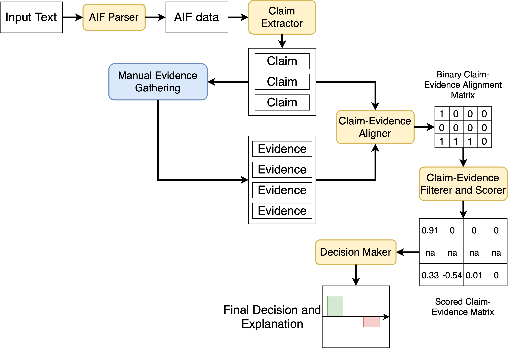

# CEASystem: Claim-Evidence Analyzer System

## About The Project
This project aims to automate and help in decision-making process based on the analysis of competitive hypothesis methodology (ACH).
The project contains modules, ready-to-use fastAPI-based service and simple niceGUI-based UI containers.

## Project Components and Architecture


On the picture, the overall flow of modules is presented. The input text is converted to the [AIF](http://www.arg-tech.org/wp-content/uploads/2011/09/aif-spec.pdf) format (see [example_aif.json](example_aif.json)) for the example.
On the next step, the claims are retrieved from the AIF graph by the rule-based approach. The provided claims are then evaluated manually and a set of evidences for the claims is provided to the system.
Claims and evidences are processed by the alignment model to determine which evidence is relevant to which claims. The obtained binary alignment matrix passed through the filtering and scoring models. Models decide how influential evidences are to the claims. Some of them will be filtered (e.g. if evidence supports all or none of the claims).
Finally, based on the scoring matrix the decision is drawn as a set of scores, how likely or unlikely for the claim to be rejected or accepted. The closer the score to +1, the more likely for the claim to be accepted. The closer it to -1, the more likely for the claim to be rejected. 
As an explanation otput, the final scoring matrix is provided, with the indications on which evidences were filtered.
<br> More details will be provided further.

## Getting Started
The repository contains two branches:
 * <i>main</i> - fastAPI app and all required classes.
 * <i>docker-ui</i> - niceGUI web page service modules.

## Running API
To run the API, you will need to download and unzip in the repo directory required trained models for the tasks:
1. Claim-Evidence Alignment model. Binary classificator that predict if the evidence is relevant to the claim. Can be downloaded here.

To run the model, you can simple run it via python: 
```commandline
python app.py
```

or with uvicorn:
```commandline
uvicorn app:app --host "0.0.0.0" --port 8000
```

## Running as Docker service
All required components and commands are in [Dockerfile](Dockerfile). Build an image and run as a container:
```commandline
cd CEASystem/
docker build . -t ceas_service
docker run -d -p 8000:8000 ceas_service
```

## Customizing behavior 
All required variables are provided in the [config.py](config.py). Specifically:
* ALIGNER_MODEL_PATH: str, path to the directory, where pre-trained aligner classifier model. Should be in huggingface saved model format. For more details, see [evidence_alignment.py](evidence_alignment.py).
* ALIGNER_BATCH_SIZE: int, batch size to use for aligner model.
* MNLI_SCORING_MODEL: str, MNLI pretrained model to use for scoring evidences/claims. Could be a link to huggingface hub (e.g. "roberta-large-mnli") or a path to a custom pre-trained model in huggingface format.
* MNLI_MODEL_LABEL_DECODER: python dict, label decoder for the model. Indicates, which labels to use and what they mean in the context of the task. For example:
```python
{"entailment": 2, "contradiction": 0}
```
In this case, the model has 3 labels: entailment, contradiction, and neutral. We are interested in entailment and contradiction only. Make sure, that the dict has these keys with the corresponding positions in the final logits of the label.
*SCORER_BATCH_SIZE: int, batch size to use for mnli model scoring.
*TURNINATOR_API: str, api route to the turninator service. 
*PROPOSITIONALIZER_API: str, api route to the propositionalizer service. 
*SEGMENTER_API: str, api route to the segmenter service. 
*RELATIONER_API: str, api route to the relationer service. 

## Running separate modules
If you need only one specific module, you can find them and their description in the corresponding files:
* [claim_extraction.py](claim_extraction.py): Classes for claim extraction from the AIF formatted argumets.
* [parsing_components.py](parsing_components.py): API calls to the APIs that parse text into AIF format.
* [evidence_alignment.py](evidence_alignment.py): Classes to predict claim-evidence alignment.
* [evidence_scoring.py](evidence_scoring.py): Classes to predict claim-evidence scores and filter irrelevant with ACH methods.
* [decision_making.py](decision_making.py): Classes to predict the overall score for the claim to be accepted/rejected with the provided claims.